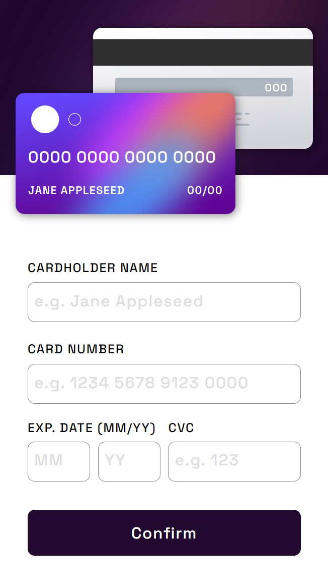
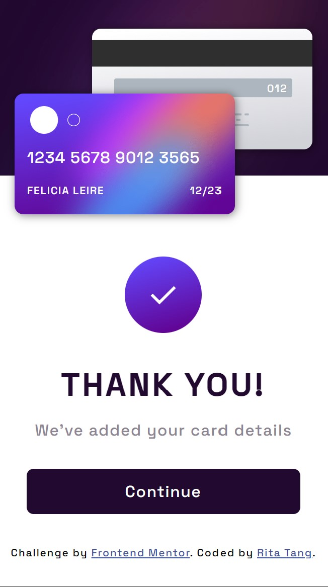
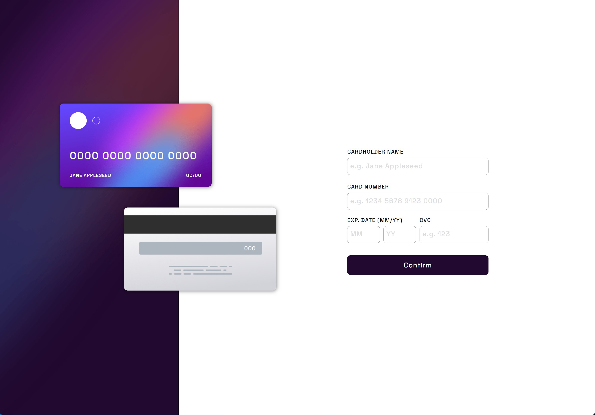

# Frontend Mentor - Interactive card details form solution

This is a solution to the [Interactive card details form challenge on Frontend Mentor](https://www.frontendmentor.io/challenges/interactive-card-details-form-XpS8cKZDWw).

## Table of contents

- [Overview](#overview)
  - [The challenge](#the-challenge)
  - [Screenshot](#screenshot)
  - [Links](#links)
- [My process](#my-process)
  - [Built with](#built-with)
  - [What I learned](#what-i-learned)
  - [Continued development](#continued-development)

## Overview

### The challenge

Users should be able to:

- Fill in the form and see the card details update in real-time
- Receive error messages when the form is submitted if:
  - Any input field is empty
  - The card number, expiry date, or CVC fields are in the wrong format
- View the optimal layout depending on their device's screen size

### Screenshot

- Mobile design




- Desktop design




### Links

- Solution URL: [Here](https://github.com/ritatanght/interactive-card-details-form)
- Live Site URL: [Here](https://ritatanght.github.io/interactive-card-details-form/)


## My process

### Built with

- Semantic HTML5 markup
- CSS custom properties
- Javascript
- Flexbox
- CSS Grid
- Mobile-first workflow

### What I learned

- ::placeholder selector can be used to change the styles of the placeholders of input field

```css
::placeholder {
  color: hsl(270, 3%, 87%);
}
```

- Onblur event is often used on input fields to target the event when the user leaves a form field. Though it is not a requirement of this challenge, I have used this to check when a user leaves the expiry month input field, if a user has entered only a single digit in the field and leaves the cell, a leading zero will be automatically added. General syntax as below:

```js
input.addEventListener("blur", validation);
```

### Continued development

- The front and back credit card here are position: absolute, though these images and the text on them are fine at the moment, I hope to find ways to improve them so they are less prone to breaking for changes in screen sizes without adding many media queries.

- For this challenge, I have used the mobile-first approach for the first time. I have found the transition from mobile to desktop design to be pretty smooth. Hence I will be using this approach for the following projects to see if it makes a difference.
